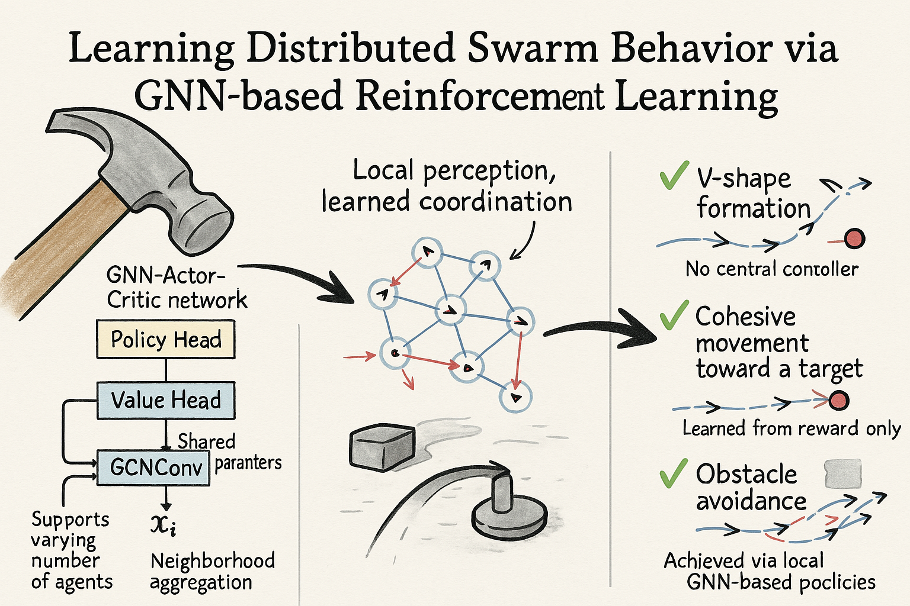

# **🧠 Equivariant RL Swarm — Parallel PPO for Collective Behavior**
[简体中文](README_CN.md) | [English](README.md)



A modular reinforcement learning framework for learning collective behavior (e.g. flocking) with GNN-based policies, Vicsek models, and random baselines. Designed with parallel sampling, visual diagnostics, stable PPO training, and swarm physics in mind — built for researchers and tinkerers alike.


## **📁 Project Structure**

```zsh
tree --dirsfirst -I "*.pt|*.0|__pycache__|run*|image.png" -n -o tree.txt
```

```
.
├── agents/                  # Policy definitions
│   ├── parallel_policy_ac.py       # GNN Actor-Critic policy (PPO-ready)
│   ├── policy_base.py              # Abstract policy base class
│   ├── random_policy.py            # Random movement baseline
│   └── vicsek_policy.py            # Vicsek-style heuristic policy
│
├── env/                     # Environment and reward logic
│   ├── base_env.py                  # Core particle update logic
│   └── reward_env.py                # Modular reward definitions
│
├── test/                    # Evaluation scripts
│   ├── test_compare_parallel.py    # Side-by-side animation & reward testing
│   ├── test_parallel_gnn_policy.py # Run a trained GNN policy
│   ├── test_random_policy.py       # Run the random baseline
│   └── test_vicsek_policy.py       # Run the Vicsek policy
│
├── test_results/            # Animation output and reward plots
│   ├── gnn_animation.mp4
│   ├── random_animation.mp4
│   ├── vicsek_animation.mp4
│   ├── compare_rewards.png
│   └── flock_animation.mp4
│
├── trainers/                # PPO training logic
│   └── parallel_ppo_trainer.py     # Parallel trainer using PPO
│
├── training_logs_parallel/  # TensorBoard logs
│
├── utils/                   # Utility modules
│   ├── evaluation_utils.py         # Evaluation and rollout helpers
│   ├── parallel_buffer.py          # Multi-agent rollout storage
│   ├── training_utils.py           # Schedulers, diagnostics
│   ├── visualization_utils.py      # Animation and plotting
│   └── seed.py                     # Reproducibility helpers
│
├── README_CN.md
├── README.md
├── requirements.txt                # Python dependencies
├── train_parallel_ppo_run.sh       # Launch script with all hyperparams
├── train_parallel_ppo.py           # Main entrypoint with argparse
└── tree.txt                        # Project structure snapshot
```


## **🚀 Getting Started**

### **1. Install dependencies**

```
pip install -r requirements.txt
```

Besides the standard libraries, **Pytorch** and **PyTorch Geometric** are required. Please install them according to your system configuration. 

**PyTorch dependencies:** [https://pytorch.org/get-started/locally/](https://pytorch.org/get-started/locally/)

**PyTorch Geometric dependencies:** [https://pytorch-geometric.readthedocs.io/en/latest/notes/installation.html](https://pytorch-geometric.readthedocs.io/en/latest/notes/installation.html)

### **2. Launch training (recommended)**

```
bash train_parallel_ppo_run.sh
```

This shell script defines and sets all hyperparameters (agent count, environment radius, GNN dim, PPO params, etc.) for a reproducible training run.

### **3. Launch TensorBoard**

```
tensorboard --logdir training_logs_parallel
```

Includes reward curves, policy/value loss, entropy evolution, log_std, etc.

### **4. Compare strategies & generate animations**

```
python test/test_compare_parallel.py
```

This will run all policies (GNN, Vicsek, Random), output individual animations, and generate a reward comparison plot in test_results/.

### **5. Run a policy manually**

```
python test/test_parallel_gnn_policy.py
```


## **📈 Features**

- Learnable log_std with entropy-aware PPO
- GNN-based Actor-Critic policy with decoupled encoders
- Explicit evaluate_actions() and log_prob() handling
- PPO with GAE, clipping, entropy bonus, and value loss
- Actions mapped via TanhTransform to [-π, π]
- Trajectory visualization with velocity arrows
- Parallel rollout collection with shared policy weights
- Safe signal handling, checkpointing, and process cleanup
- Modular reward functions for physical constraints


## **⚙️ Parallel Training Details**

- Uses multiprocessing for fast rollout collection
- Shared policy weights across workers
- Central trainer coordinates sampling & policy updates
- Asynchronous evaluation and policy checkpointing
- PPO steps batched across environment threads


## **📄 Notable Files**

- train_parallel_ppo_run.sh: Shell script to launch training with all config flags
- train_parallel_ppo.py: Main launcher and CLI interface
- parallel_ppo_trainer.py: Training loop + policy updates
- parallel_policy_ac.py: Actor-Critic GNN architecture with log_std and evaluate support


## **🧪 Future Work & TODO**

- Equivariant GNN integration (e.g. e3nn / TFN)
- Attention-based policy (GATConv-style or Transformer head)
- Curriculum-based reward scaling
- Gridworld-like environment & obstacle modeling
- Energy-based or physics-inspired interaction rules


## **🧠 Author Note**

This repo began as an exploration of whether GNNs and reinforcement learning can recreate collective intelligence from scratch. The current version emphasizes:

- Training stability in sparse reward settings
- Action-space symmetry handling
- Modular code for fast debugging and experimentation