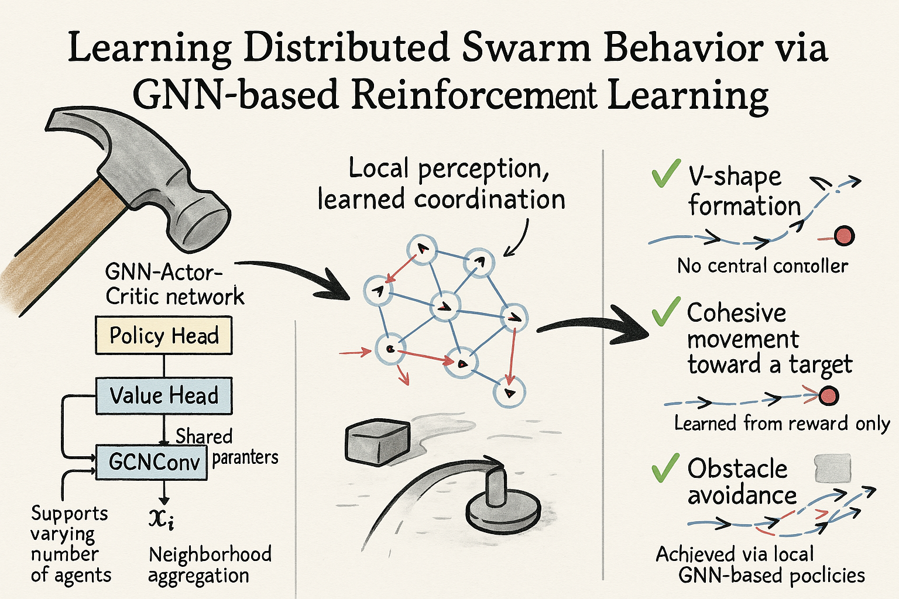

# **🧠 Equivariant RL Swarm — Parallel PPO for Collective Behavior**
[简体中文](README_CN.md) | [English](README.md)




一个面向群体智能（flocking/swarming）任务的强化学习平台，支持基于 GNN 的策略学习、Vicsek 模型比较、多进程并行采样、粒子系统模拟和可视化。项目结构清晰、模块独立、调试友好，适合研究者在此基础上构建更复杂的群体感知与控制模型。


## **📁 项目结构**

```zsh
tree --dirsfirst -I "*.pt|*.0|__pycache__|run*|image.png" -n -o tree.txt
```

```
.
├── agents/                  # 策略定义
│   ├── parallel_policy_ac.py       # GNN Actor-Critic policy（支持 evaluate_actions + log_std）
│   ├── policy_base.py              # 所有策略的抽象接口
│   ├── random_policy.py            # 随机策略 baseline
│   └── vicsek_policy.py            # Vicsek 模拟策略 baseline
│
├── env/                     # 环境定义
│   ├── base_env.py                  # 基础粒子更新逻辑
│   └── reward_env.py                # 奖励函数封装（可组合模块）
│
├── test/                    # 各策略测试脚本
│   ├── test_compare_parallel.py    # 并列测试三种策略并生成动画
│   ├── test_parallel_gnn_policy.py # 只运行训练好的 GNN 策略
│   ├── test_random_policy.py       # 跑 random baseline
│   └── test_vicsek_policy.py       # 跑 Vicsek baseline
│
├── test_results/            # 动画输出 & reward 曲线
│   ├── gnn_animation.mp4
│   ├── random_animation.mp4
│   ├── vicsek_animation.mp4
│   ├── compare_rewards.png
│   └── flock_animation.mp4 
│
├── trainers/                # PPO训练器
│   └── parallel_ppo_trainer.py     # 支持异步并行采样和梯度更新
│
├── training_logs_parallel/  # TensorBoard日志目录
│
├── utils/                   # 工具包
│   ├── evaluation_utils.py         # rollout评估函数
│   ├── parallel_buffer.py          # 多进程经验缓存器
│   ├── training_utils.py           # 学习率调度、策略调试等
│   ├── visualization_utils.py      # 动画渲染、reward曲线绘制
│   └── seed.py                     # 全局种子控制
│
├── README_CN.md
├── README.md
├── requirements.txt                # Python 依赖
├── train_parallel_ppo_run.sh       # 主训练脚本（zsh）
├── train_parallel_ppo.py           # 主入口，支持 argparse 配置
└── tree.txt                        # 目录结构快照
```


## **🚀 快速开始**

### **1. 安装依赖**

```
pip install -r requirements.txt
```

此外，还需要安装 PyTorch 和 Pytorch Geometric，具体请参考 [PyTorch 官网](https://pytorch.org/get-started/locally/) 和 [PyG 官网](https://pytorch-geometric.readthedocs.io/en/latest/notes/installation.html)。

### **2. 启动训练（推荐）**

```
bash train_parallel_ppo_run.sh
```

这个脚本中设置了所有超参数和环境变量（agent 数量、box size、radius、PPO参数等），可复现性好。

### **3. 查看日志**

```
tensorboard --logdir training_logs_parallel
```

包含 reward 曲线、loss 曲线、动作均值/std、log_std 演化等。

### **4. 策略对比 & 动画生成**

```
python test/test_compare_parallel.py
```

运行后会在 test_results/ 下生成每个策略的单独动画（.mp4）和 reward 对比曲线。

### **5. 运行某一策略进行观察**

```
python test/test_parallel_gnn_policy.py
```


## **🎯 模型与训练特点**

- GNN Actor-Critic 策略，支持 evaluate_actions() 与 log_prob() 显式调用
- Learnable log_std + entropy loss，有效防止策略坍缩
- PPO 训练包括 policy loss、value loss、entropy bonus
- GAE 优势估计 + reward 平滑 + 动作分布正则
- 动作限制通过 TanhTransform 映射至 [-π, π]
- 可视化包括：动作方向箭头、轨迹粒子动画、reward 曲线


## **⚙️ 并行训练细节**

- 支持多进程并行采样（AsyncVectorEnv 风格）
- 每个采样器共享策略权重，主进程统一更新参数
- 经验缓存采用 ParallelBuffer 统一管理
- 支持 ctrl+C 安全中断，自动保存当前模型
- 每 N 步保存 checkpoint，可选启用最优策略保存机制


## **📄 主要文件**

- train_parallel_ppo_run.sh：标准化启动脚本，定义完整 config
- train_parallel_ppo.py：主程序入口，组织环境初始化、策略构建、trainer 执行
- parallel_ppo_trainer.py：PPO 核心逻辑 + 多线程 rollout 管理
- parallel_policy_ac.py：策略网络结构，支持 actor/critic 分开 GCN 编码器


## **✨ TODO / 延展方向**

- 支持 e3nn / SE(2) equivariant GNN（对称性增强）
- 多头策略结构（attention / role-based）
- Curriculum / curriculum-aware PPO scheduler
- Grid 环境结构或障碍物干扰建模
- 更真实的粒子互动建模（电荷、感知盲区等）


## **🧠 注记**

这个 repo 起初是为了研究群体智能中粒子如何通过 GNN + RL 自发形成协同行为。我们设计了一整套训练流水线，专注于：

- 实现稳定的 PPO 收敛
- 动作空间对称性（方向、群体位置）
- 强调策略是否“真的学到了结构”